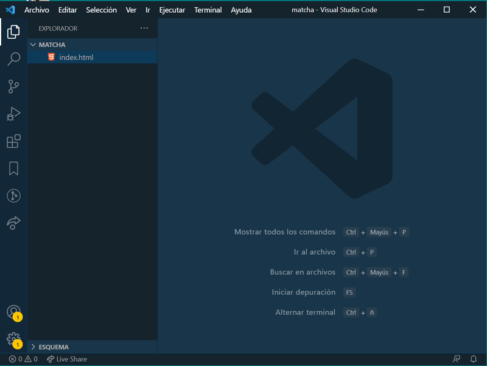

# Ej. 02 - Creando nuestro HTML

## Objetivos
1. Aprender a usar el Visual Studio Code para editar archivos HTML/CSS.
2. Configurar el encabezado de tu proyecto usando HTML.

---
<br/>

## Requisitos

- Tener Git Bash si usas Windows.
- Tener Visual Studio Code instalado.

---
<br/>

## Instrucciones

Es momento de abrir nuestro editor de texto. Usaremos en este módulo Visual Studio Code (VSCode) y debes
abrir con VSCode el directorio "matcha" que creamos en nuestra terminal. Recuerda la estructura:

```text
Documents/
└── matcha/
    └── index.html
```
Esta imagen te da una idea de cómo debe quedar abierto tu VSCode en el directorio `/matcha`:



En tu VSCode debes seleccionar tu archivo `index.html` con un doble clic, y ¡prepárate para ensuciarte las manos!.

Las etiquetas mínimas a incluir en todos los documentos de HTML que creemos son:

```html
<!DOCTYPE html>
<html>
  <head>
    <!-- Aquí va información importante pero no visible dentro del navegador -->
    <title>Matcha</title>
  </head>
  <body>
    <!-- Esto es lo que se verá en el navegador web -->
  </body>
</html>
```

Analicemos las etiquetas del código anterior:

- `<!DOCTYPE html>`. Esta etiqueta rompe con el patrón de las sintaxis vistas
  anteriormente, pero no te preocupes, es una de las únicas que tienen una
  sintaxis particular y la usarás para indicarle al navegador web la versión
  de HTML que usarás. En este caso, esta sintaxis está indicando que usaremos
  `HTML 5`. Resulta que `HTML` ha pasado por diversas versiones, la diferencia
  entre ellas son principalmente las capacidades que estas soportan. Por ejemplo,
  más adelante te darás cuenta que existen etiquetas en `HTML 5` que te ayudarán a expresar
  mejor el tipo de contenido que estas reflejarán al navegador (ejemplo: `nav`,
  `section`, `header`, `footer`, entre otras), que en versiones anteriores del
  lenguaje no existían.

  Ejemplo de cómo indicar al navegador que usaremos HTML 4:

  ```html
  <!DOCTYPE html PUBLIC "-//W3C//DTD HTML 4.01//EN" "http://www.w3.org/TR/html4/strict.dtd">
  ```

  ¿Mejor nos quedamos con `HTML 5`, no?

- `<html></html>`. Es momento de que te enteres que todo en HTML tiene una
  estructura jerárquica, y como en toda jerarquía, siempre existe un extremo a
  partir del cual todo inicia. Esta es la etiqueta que indica el punto de partida
  de la página, todo lo que se encuentre dentro será el contenido que el
  navegador tomará en cuenta para mostrar a los usuarios. Esta etiqueta en
  particular tiene 2 _"hijos"_ que encontrarás en todas las páginas web:
  `<head></head>` y `<body></body>`.

- `<head></head>`. En esta etiqueta se encontrará toda la información relevante
  del sitio web pero que no se muestran en la interfase visual. Por ejemplo, acá podemos
  indicar el título de la página, el ícono que aparece en la pestaña del navegador,
  si se debe importar algún estilo que personalice la apariencia de nuestro contenido,
  información de la descripción de la página para que se muestren en los resultados de búsqueda de internet,
  etc.

- `<title></title>`. Esta etiqueta permite indicar cuál es el título que el
  navegador debe mostrar cuando un usuario este navegando en nuestro sitio web.

- `<body></body>`. Esta etiqueta nos sirve para delimitar todo el contenido de
  la página web y es dentro de ella que encontramos todo lo que vemos cada vez
  que visitamos un sitio. Botones, textos, imágenes y demás elementos se definen dentro
  de esta etiqueta.

  <br/>

[Siguiente](../Ejemplo%2003/README.md)