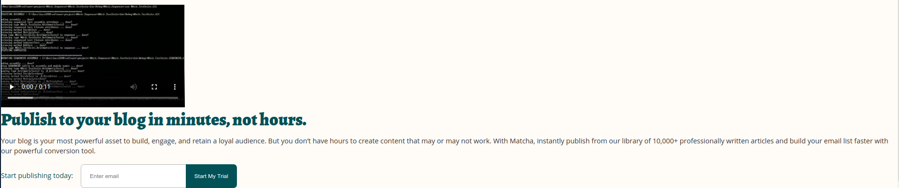

# Reto 03 - Agrega la sección de publicidad

## Objetivos
- Agregar una segunda columna de contenido.
- Agregar estilos en la segunda columna.

---
<br/>

## Requisitos
- Tener instalado Visual Studio Code.

## Instrucciones

Ya tenemos el video en nuestra página, ahora, si revisamos la web de Matcha, nos
vamos a dar cuenta que tiene un texto publicitario junto con un formulario
similar al que utilizamos en la parte de inicio, el reto consiste en que lo puedas
agregar, aun no es necesario alinearlo, no hay problema que todo se vea debajo,
no intentes usar el `display: inline-block` de la sesión anterior, puesto que
estaremos usando otra manera más adelante.

> TIP: Ya que tienes que agregar un encabezado, seguido de un párrafo y un formulario,
te recomendamos envolver todos estos elementos en un contenedor (idealmente
semántico).

Ten en cuenta lo siguiente:

- Usa la fuente que deseas para el encabezado de la sección
- El color de fuente del encabezado y del texto que precede al formulario es
  `#025157`
- El color de fuente del párrafo es `#343434`
- Dependiendo del selector que usaste, ¿cómo reutilizarías tus estilos del
  formulario de la parte inicial para este nuevo formulario muy similar?

  <br/>

<details>
  <summary>Posible solución</summary>

Agregamos el HTML dentro de un `article` aplicando los estilos necesarios a
través de clases.

```html
<section>
  <video
    controls
    poster="https://cdn.videvo.net/videvo_files/video/premium/video0036/thumbnails/computer_code00_small.jpg"
  >
    <source
      type="video/webm"
      src="https://cdn.videvo.net/videvo_files/video/premium/video0036/small_watermarked/computer_code00_preview.webm"
    />
    <source
      type="video/mp4"
      src="https://cdn.videvo.net/videvo_files/video/premium/video0036/small_watermarked/computer_code00_preview.mp4"
    />
  </video>
  <article class="publish">
    <h3>Publish to your blog in minutes, not hours.</h3>
    <p>
      Your blog is your most powerful asset to build, engage, and retain a loyal
      audience. But you don’t have hours to create content that may or may not
      work. With Matcha, instantly publish from our library of 10,000+
      professionally written articles and build your email list faster with our
      powerful conversion tool.
    </p>
    <form>
      <p>Start publishing today:</p>
      <div>
        <input type="text" placeholder="Enter email" />
        <button>Start My Trial</button>
      </div>
    </form>
  </article>
</section>
```

```css
.publish {
  /* container styles if any */
}

.publish h3 {
  font-family: "Alegreya", serif;
  font-size: 40px;
  line-height: 48px;
  color: #025157;
}

.publish > p {
  font-size: 16px;
  color: #343434;
  line-height: 1.5;
  margin-bottom: 20px;
}

.publish > form {
  display: flex;
}

.publish > form p {
  color: #025157;
  margin-right: 18px;
}
```

Resultando algo así:



</details>

<br/>

[Siguiente](../Ejemplo-04/README.md)