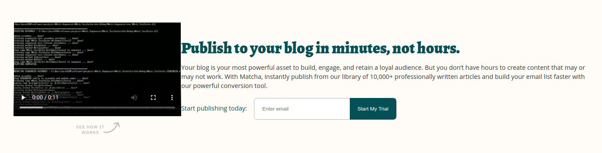

# Reto 04 - Agregando contenedor al video para agregar imagen
## Objetivos
- Configurar Flexbox para acomodar contenido verticalmente

---
<br/>

## Requisitos
- Tener Git Bash si usas Windows.
- Tener conocimientos básicos de HTML y CSS


---
<br/>

## Instrucciones

¿Te diste cuenta que hay una imagen debajo del video que no hemos agregado ni
considerado? ¿Cómo va a afectar esto lo que llevamos actualmente? Bien, es tu
momento de aplicar Flexbox por tu cuenta, vas a necesitar meter el video dentro
de un contenedor para que luego puedas agregar la imagen debajo y puedas
alinearlos con Flexbox.

La imagen lo puedes encontrar [aquí](https://getmatcha.com/wp-content/themes/getmatcha/img/see_how_it_works.png).

<br/>

> TIP: Como la imagen irá debajo del video, el contenedor debe de cambiar la dirección de los elementos a `column`.

<br/>

<details>
  <summary>Posible solución</summary>

Envuelve el video en un contenedor, agrega la imagen, asigna `display: flex` al
contenedor y cambia la dirección a `column`. Luego alinea los flex items.

```html
<section class="promo">
  <article class="explanatory-video">
    <video><!-- Fuentes del video --></video>
    
  </article>
  <!-- Contenido publicitario -->
  <!-- ... -->
</section>
```

```css
.explanatory-video {
  display: flex;
  flex-direction: column;
  align-items: center;
}

.explanatory-video img {
  width: 120px;
  margin-top: 10px;
}
```

Resultando algo como:



</details>

<br/>

[Siguiente](../Ejemplo-05/README.md)