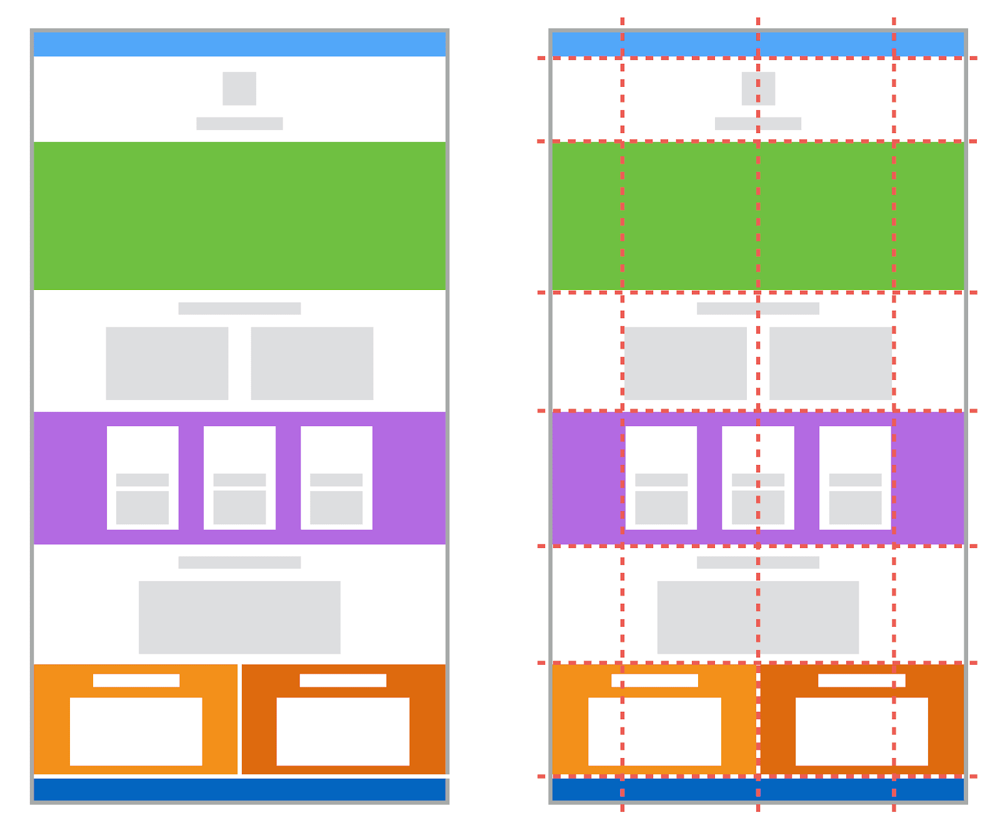

# Sesión 04: Agregando filas y columnas con CSS Grid

## Introducción
La sesión pasada aprendimos sobre la tecnología Flexbox, que nos ayuda a distribuir los elementos de manera lineal, sea en filas o columnas. Sin embargo, para arreglos bidimensionales como son una galería de imágenes o alinear varios elementos en más de una fila o columna, podemos utilizar otra tecnología de CSS: Grid.

# Grid CSS

El término **grid**, **cuadrícula** o **rejilla** en CSS hace referencia a la apariencia de filas y columnas que generan los elementos de CSS.

Anteriormente, para lograr esta apariencia solo teníamos los display de `inline-block` y propiedades como `float`, posteriormente con la aparición de Flexbox podíamos simular este comportamiento de manera flexible.

Sin embargo, no existía ninguna forma nativa dedicada a este formato que es muy común encontrar en las páginas web modernas.

 

 

Sin embargo, en CSS3 tenemos un **nuevo conjunto de propiedades** que nos permiten lograr este objetivo de una manera más práctica y sencillo, que toma el nombre de Grid CSS.

 

## Objetivos

En esta sesión aprenderás:

- Estructurar elementos en formato de filas y columnas.
- Posicionar elementos en base a la posición de otros de manera flexible.
- Usar comandos de git para obtener cambios realizados por terceros.
- Desplegar los cambios a nuestra página web hosteada en Netlify.
---
 

## Requisitos

- Git instalado.
- Navegador web.
- Tener Visual Studio Code instalado.

---
 

## Organización de la clase

- [Ejemplo 01: Obteniendo cambios con `git pull` ( 15 minutos ) ](./Ejemplo-01/README.md)

- [Ejemplo  02: Agregando características principales de Matcha ( 25 minutos ) ](./reto-01/README.md)

- [Reto  01: Grid con 3 columnas iguales ( 15 minutos ) ](./Ejemplo-02/README.md)

- [Reto  02: Grid 2 filas con alto de `330px` ( 15 minutos ) ](./reto-02/README.md)

- [Reto  03: Grid con 2 filas y 2 columnas ( 20 minutos ) ](./Ejemplo-03/README.md)

- [Reto  04: Agregando el contenido de las tarjetas ( 35 minutos ) ](./reto-04/README.md)

- [Postwork ( 20 minutos ) ](./postwork/README.md)

 

[Regresar](../README.md)