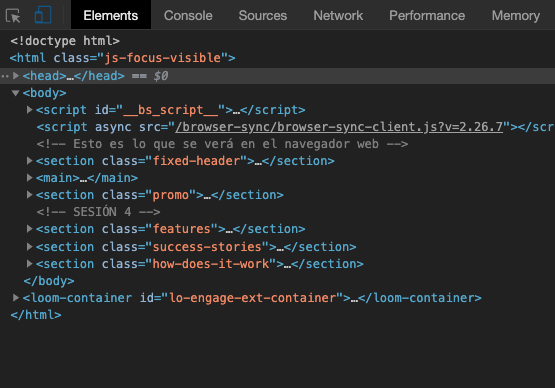
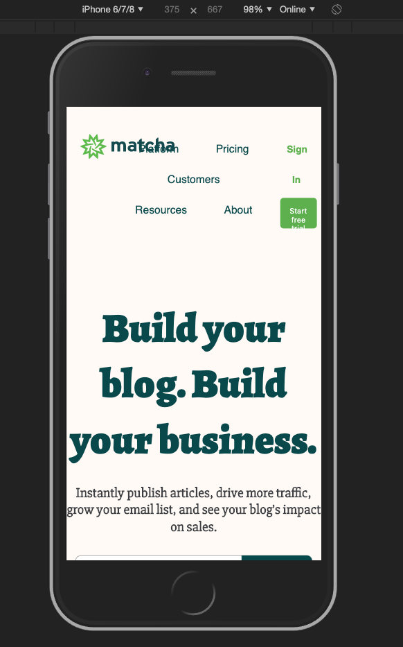

# Ej. 01 - Inspeccionando tu sitio desde un móvil

## Introducción
Una de las maneras más útiles disponibles para observar el contenido de nuestro desarrollo en diversas pantallas, lo tenemos disponible en nuestro navegador. Hoy practicaremos como adaptar nuestro contenido con la vista responsive de la consola del desarrollador en el navegador.

## Requisitos
- Tener instalado Chrome o Firefox.
- Tener instalado Visual Studio Code.

## Desarrollo

Para poder adaptar nuestra página a un móvil por ejemplo, necesitamos saber cómo
se ve actualmente, y si bien podríamos tomar nuestro celular y entrar nuestra página en Netlify, no nos ayudaría mucho porque queremos realizar cambios y ver inmediatamente cómo resulta dicho cambio, como lo hemos venido haciendo para desarrollar nuestra página en el navegador.

Debido a que esto es algo común para los desarrolladores web, los navegadores
han implementado un visualizador responsivo en sus herramientas de desarrollo
que nos permiten emular la experiencia que un usuario desde un dispositivo
distinto a una laptop o computadora tiene cuando entra a nuestra página, lo mejor
es que si nosotros realizamos algún cambio, este se podrá ver reflejado y
podremos analizar si el cambio fue el correcto y/o esperado.

Para entrar en este modo responsivo, debemos ingresar a las herramientas de
desarrollo de nuestro navegador y en la parte superior donde muestra diversas
pestañas (entre ellas la de `Elements` o `Elementos` que hemos ido usando a lo
largo de este curso), aparecerá al lado izquierdo un ícono de la forma de un
móvil y una tablet detrás, si damos click sobre dicho ícono, se sombreará y el
espacio de nuestra web cambiará.

<br/>



<br/>

# Agregando meta viewport

Antes de personalizar la apariencia en la experiencia móvil de nuestro sitio,
debemos de agregar una etiqueta de metadatos que permite al navegador saber
cómo manejar nuestro sitio cuando se accede desde un tipo de dispositivo
diferente.

Estamos hablando de una etiqueta `<meta />` que nos permite establecer
características por defecto de nuestror `viewport`.

```html
<!DOCTYPE html>
<html>
  <head>
    <meta
      name="viewport"
      content="width=device-width,initial-scale=1.0,user-scalable=no"
    />
    <!-- Resto de etiquetas del head -->
  </head>
  <body>
    <!-- ... -->
  </body>
</html>
```

> TIP:
> Notar que hemos puesto esta etiqueta `<meta />` dentro del `<head></head>` de nuestro código y no dentro del `<body></body>` como la mayoría de etiquetas que hemos ido aprendiendo hasta el momento. Esto es debido a que no tiene ninguna representación visual y sobretodo sirve para informar al navegador de cómo tratar cierto tipo de contenido.

<br/>

En el valor del atributo `content` de esta etiqueta hemos establecido ciertas
reglas tales como indicar que el width siempre va a hacer el tamaño del dispositivo
del cuál se está viendo nuestro sitio web, a su vez, por defecto indicamos que
la escala inicial de la página es de 1, esto nos sirve para dispositivos táctiles
que tienen capacidad de hacer zoom y que pueden alterar la escala en la que se
visualiza la página y por último indicamos que el usuario no pueda hacer zoom
desde una pantalla táctil.

Aplicando este cambio a nuestro sitio veremos que todo el texto se sobrepone y
que la experiencia termina siendo muy mala. Ejemplo:

<br/>



<br/>

[Siguiente](../Ejemplo-02/README.md)