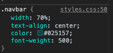
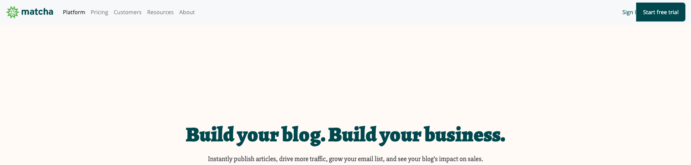

# Reto-06 Recuperando los estilos de la barra de navegación

## Objetivos
1. Aprender cómo modificar los componentes de Bootstrap en cuanto a estilos
2. Aprender cómo instalar estilos propios en componentes de Bootstrap
3. Aprender como utilizar los estilos provistos por Bootstrap

## Requisitos
- Tener Visual Studio Code instalado

## Instrucciones


La barra de navegación ya tiene nuestro contenido, pero en definitiva no es lo que necesitamos. ¿Podrías agregar o modificar los estilos y revisar qué tan bien se ve en pantallas medianas y grandes?

<details>
  <summary>Posible solución</summary>

Comencemos por indicarle a la barra de navegación que ocupe todo el ancho de la
pantalla, en lugar de solo una parte. Si analizamos los estilos que tiene la etiqueta `nav`, nos daremos cuenta que tiene un estilo que limita su ancho al 70% del ancho de su contenedor:



Y como bien indican las herramientas de desarrollo, son estilos que se aplicaron
en el archivo `styles.css` que nosotros creamos.

:::tip

¿Por qué se puede haber originado este error? Resulta que Bootstrap utiliza una
clase llamada `navbar` para ponerle sus propios estilos, y nosotros
coincidentemente usamos el mismo nombre. Sin embargo, al momento que pusimos los estilos de Bootstrap antes que el nuestro (cuando incluimos las etiquetas `<link />` en el HTML), nuestros valores de propiedades CSS en los estilos predominan sobre los de Bootstrap a pesar de tener el mismo nombre.

:::

Eliminando el ancho de la clase `.navbar` quedaría así:

```css
.navbar {
  text-align: center;
  color: #025157;
  font-weight: 500;
}
```

Resultando en la barra de navegación tomando el ancho disponible del contenedor:



Lo siguiente que corregiremos será el color, ya que ha tomado el color gris que
la mayoría de componentes de Bootstrap usa por defecto. Para esto, no es
necesario sobreescribir los estilos en la clase `.navbar`. El color
de fondo lo puedes [configurar](https://getbootstrap.com/docs/5.1/components/navbar/#color-schemes) según lo muestra la documentación de Bootstrap.

Quitando la clase `bg-light` que está añadida a la etiqueta `<nav></nav>` recuperaremos el color original de la barra, quedando nuestra etiqueta nav de la siguiente forma:

```html
<nav class="navbar navbar-expand-lg navbar-light">
  <!-- resto del código -->
</nav>
```

:::tip

Si deseas saber que otras clases relacionadas con los colores de fondo existen
en Bootstrap, puedes consultar [esta sección de la documentación](https://getbootstrap.com/docs/5.1/utilities/background/).

:::

Ahora procedamos a corregir la alineación del menú de navegación, ya que
aparece junto al logo en la parte izquierda de la pantalla y debería estar
alineado al centro del espacio disponible del contenedor. Para esto, debemos
modificar los estilos de la etiqueta `<ul></ul`.

Dicha etiqueta en estos momentos tiene 2 clases (`navbar-nav` y `mr-auto`). La primera clase `navbar-nav` es importante para poder indicar que los elementos de dicha lista son los que conformarán el menú de navegación, mientras que la segunda clase `mr-auto` indica que dicha lista debe tener un margen derecho automático, y dado que a los elementos de la lista Bootstrap les asigna un `display: block;` podemos alinear su
contenido aplicando un margen automático a cada lado. Bootstrap nos permite hacer
dicho comportamiento a través de una clase llamada `mx-auto`. Por lo tanto,
reemplazaremos la clase `mr-auto` por `mx-auto`:

```html
<ul class="navbar-nav mx-auto">
  <!-- lista del menú de navegación -->
</ul>
```

:::tip

Si deseas saber qué otras clases utilitarias relacionas a espaciado que tiene
Bootstrap para ti, puedes revisar [esta sección de la documentación](https://getbootstrap.com/docs/5.1/utilities/spacing/).

:::

Resultando en:


Para terminar de cambiar la barra de navegación a como estaba originalmente, debemos corregir los estilos de la sección de acciones. Si analizamos un poco
los estilos que teníamos anteriormente, nos daremos cuenta que sus estilos
dependían de la clase de su contenedor llamada `actions`. Así que para no
sobreescribir ningún estilo o escribir una clase nueva, podemos tomar la clase
que nosotros habíamos creado y agregársela a las clases que actualmente tiene el
formulario, resultando de la siguiente manera:

```html
<form class="form-inline my-2 my-lg-0 actions">
  <!-- acciones -->
</form>
```

Como último detalle de las acciones, podemos notar que el espacio que existe
hacia el lado derecho entre el botón y el borde del navegador es más grande que
el espacio entre el logo y el borde izquierdo del navegador. Esto sucede debido
a que la clase `form-inline` convierte al formulario en un _flex container_ y configura asi el contenido alineándolo al centro en el eje horizontal, mientras
que nosotros necesitaríamos que se acomode hacia el final de su eje horizontal.
Normalmente lograríamos esto usando `justify-content: flex-end;`, pero como
usamos Bootstrap, podemos hacer uso de una clase llamada `justify-content-end`:

```html
<form class="form-inline my-2 my-lg-0 actions justify-content-end">
  <!-- acciones -->
</form>
```

:::tip

Si deseas saber qué otras clases relacionadas a Flexbox tiene Bootstrap para ti,
puedes revisar [esta sección de la documentación](https://getbootstrap.com/docs/5.1/utilities/flex/).

:::

Con estos cambios la mayoría de estilos debería de volver a verse similar a como
lo teníamos antes:


Ahora, si comenzamos por cambiar el tamaño del navegador a uno más pequeño, llegaremos a un punto en el que nuestra barra de navegación se rompe:


En este caso, el problema viene dado porque la clase `actions` tiene una
propiedad `width` con valor del 15% del tamaño de su contenedor, y dado que
Bootstrap está usando Flexbox para manejar el ancho de sus elementos, no es
necesaria dicha propiedad. Una solución es eliminar `width`, quedando la clase `actions` de la siguiente manera:

```css
.actions {
  text-align: right;
  font-weight: 600;
  font-size: 14px;
}
```

Hemos terminado con la vista desktop. Intenta usar el emulador móvil en tu navegador, y busca una resolución **Mobile L-425px**. ¿Dónde quedó la barra de navegación? No te preocupes, la siguiente sesión resolveremos ese misterio...


</details>


[Siguiente](../postwork/README.md)

