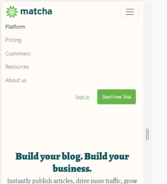
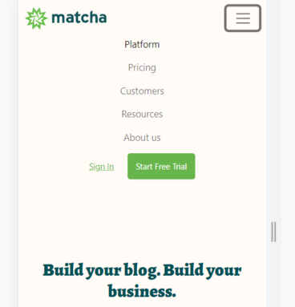

# Ej. 01 - Agregando javascript al proyecto

## Introducción

El framework de Bootstrap también utiliza un lenguaje de programación para lograr que algunos de sus elementos puedan funcionar correctamente. Este paso dentro de tu proyecto es importante para que la funcionalidad que necesitas se encuentre presente siempre.
## Objetivos
1. Insertar los scripts de Javascript que utiliza Bootstrap.

## Requisitos

1. Tener instalado Visual Studio Code.

## Desarrollo

En la sección de inicio de la documentación de Bootstrap, nosotros encontramos
los links para el código fuente del CSS de este framework y los agregamos a
nuestro HTML. Lo mismo sucede con JavaScript. En esta ocasión, nosotros no
queremos agregar el CSS de Bootstrap, ahora queremos agregar el JS que este
framework nos provee. Para esto, podemos ir a la [documentación oficial](https://getbootstrap.com/docs/5.1/getting-started/introduction/#js) y copiar el elemento que menciona en la sección **[Bundle](https://getbootstrap.com/docs/5.1/getting-started/introduction/#bundle)**.

Ahora, siguiendo las instrucciones de la documentación, simplemente pegamos ese pequeño tag `<script>`en nuestro desarrollo justo arriba de la etiqueta de cierre `</body>`.

```html
<body>
  <!-- Aqui va todo el contenido del proyecto -->
  <script src="https://cdn.jsdelivr.net/npm/bootstrap@5.1.3/dist/js/bootstrap.bundle.min.js"
    integrity="sha384-ka7Sk0Gln4gmtz2MlQnikT1wXgYsOg+OMhuP+IlRH9sENBO0LRn5q+8nbTov4+1p"
    crossorigin="anonymous"></script>
</body>
```
Si reduces la pantalla en la vista responsive del navegador, observarás que la información de la barra de navegación no está bien acomodada.



Esto se debe a los estilos que establecimos en el media query. Hay que modificarlos de esta manera:

```css
  .actions,
  .navbar {
    text-align: center;
  }
```
Ahora, nuestra barra de navegación en pantallas pequeñas se ve correctamente alineada.



Con esto, ya tenemos la funcionalidad completa de Bootstrap, estilos y componentes, con lo que nuestro desarrollo tenderá a ser más ágil y rápido. Sin embargo, te sugerimos practicar continuamente para que llegues a dominar el completo potencial de este framework de CSS.

<br/>

[Siguiente](../reto-01)