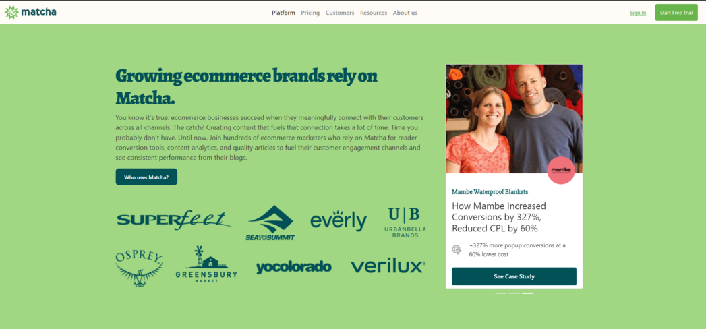

# Reto 02 - Agregar Carousel y la primer tarjeta

## Objetivos
1- Configurar y personalizar dos componentes de Bootstrap: Carrusel y Tarjeta.

## Requisitos
- Tener Visual Stuido Code instalado.
- Conocer qué es un framework de CSS.
- Saber cómo funciona la propiedad `position: absolute` de CSS

## Instrucciones

- Inserta el contenido de la primer tarjeta en el carrusel, sustituyendo el primer `` por tu código de la tarjeta
- Modifica los estilos de la tarjeta para que puedas ajustar visualmente los elementos.
- Agrega las dos tarjetas restantes en el sitio de los `` respectivos.



<details>
  <summary>Posible solución</summary>

  Inserta tu tarjeta y modifica el CSS correspondiente

```html
    <div class="carousel-item active">
      <!-- Tarjeta 1: Everly -->
      <div class="card">
        
        <div class="card-body">
          <div class="card-circle everly">
            
          </div>
          <h4>Everly</h4>
          <h3>
            Early-Stage CPG Brand Increases Lead Conversion 20x,
            Ecommerce Revenue 20%
          </h3>
          <div class="results">
            
            <p>22% of monthly revenue influenced by content</p>
          </div>
        </div>
        <div class="card-footer">
          <button>See Case Study</button>
        </div>
      </div>
    </div>
```

  Modifica el CSS para ajustar el estilo visual al ejemplo de [Matcha](https://bedu-fef.netlify.app/).

```css

  /* Cambiamos el alto mínimo de la tarjeta, para que se vea bien en responsive */
    .success-stories .card {
      max-width: 370px;
      width: 100%;
      min-height: 600px;
      margin: 0 auto;
    }

   /* Con object-fit, hacemos que la imagen se ajuste a la medida de su contenedor y limitamos su alto */
    .success-stories .card img {
      max-height: 30vh;
      object-fit: cover;
    }

   /* Agregamos position: relative para recibir un elemento con position:absolute más adelante */
    .success-stories .card .card-body {
      max-width: 370px;
      width: 100%;
      position: relative;
      padding: 40px 1rem 1rem;
    }

    /* Estos son los estilos para textos y acomodo de elementos */
    .success-stories .card .card-body h4 {
      color: #025157;
      font-size: 18px;
      font-weight: 600;
      line-height: 20px;
      margin-bottom: 12px;
      font-family: "Slabo 27px", serif;
    }

    .success-stories .card .card-body h3 {
      font-size: 25px;
      font-weight: 400;
      line-height: 30px;
      margin-bottom: 20px;
    }

    .success-stories .card .card-body .results {
      display: flex;
      justify-content: flex-start;
      align-items: center;
    }

    .success-stories .card .card-body .results img {
      width: 26px;
      margin-right: 20px;
    }

    .success-stories .card .card-body .results p {
      margin: 0;
    }

    .success-stories .card .card-footer button {
      display: block;
      margin-left: 0;
      border-radius: 5px;
      font-size: 13;
      font-weight: 600;
      padding: 12px 20px;
      width: 100%;
      background-color: #025157;
      color: #fff;
      border: none;
    }

    .success-stories .card .card-footer {
      background-color: #ffffff;
      color: #fff;
      border: none;
    }

    /* Aqui hacemos un círculo con CSS! Este se posicionará en el margen superior de .card-body */
    .success-stories .card .card-body .card-circle {
      display: flex;
      align-items: center;
      position: absolute;
      top:-45px;
      right: 20px;
      width: 75px;
      height: 75px;
      border-radius: 50%;
      padding: 5px;
    }

    /* Cada círculo tiene su propio color. Verifica qué significa este selector: .card-circle.everly */
    .success-stories .card .card-body .card-circle.everly {
      background-color: #f9da73;
      border: 5px solid #f9da73;
    }

    /* Los círculos deben recibir la imagen y ajustarla al tamaño */
    .success-stories .card .card-body .card-circle.everly img {
      object-fit: contain;
      width: 100%;
    }

```


</details>
<br/>

[Siguiente](../reto-03/README.md)
