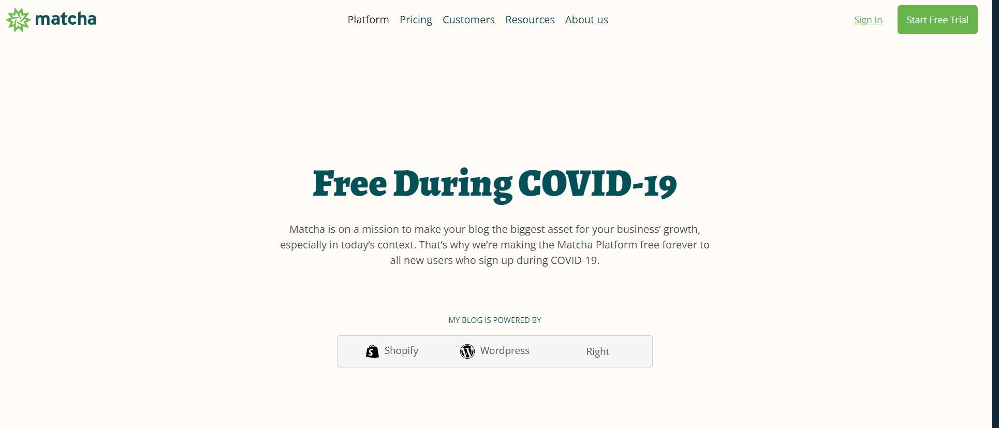

# Reto 04 - Agregando la sección principal y botones

## Objetivos
1. Insertar el contenido principal de nuestra nueva página al proyecto.


## Requisitos
- Tener instalado Visual Studio Code.
  

<br/>

## Instrucciones

Nuestra página habla un poco acerca del costo del servicio. Por ello, debemos crear nuestro código para que el resultado se vea así:



<br/>

> TIP: Al ser este un caso común, Bootstrap tiene clases utilitarias que pueden ayudar a desarrollar rápidamente estos elementos, o puedes optar por diseñarlos a mano.

<br/>

<details>
  <summary>Posible solución</summary>

Podemos insertar un elemento con un contenedor, para tener la posibilidad de controlar el acomodo de los diversos elementos que tiene este diseño.

```html
    <main class="header">
      <article>
        <h1>Free During COVID-19</h1>
        <p>
          Matcha is on a mission to make your blog the biggest asset for your
          business’ growth, especially in today’s context. That’s why we’re
          making the Matcha Platform free forever to all new users who sign up
          during COVID-19.
        </p>
      </article>
    </main>
```

</details>

<br/>

[Siguiente](../Ejemplo-04/README.md)