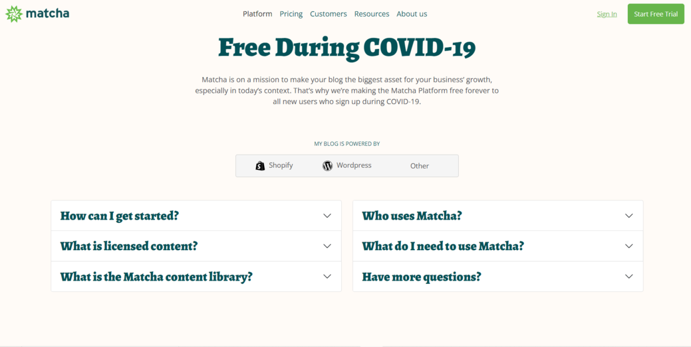

# Reto 05 - Agregando la segunda columna de nuestras FAQ

## Objetivos
1. Agregar nuevos elementos de Bootstrap así como la personalización de los mismos.
2. Utilizar los estilos de Bootstrap para acomodar elementos en la pantalla.
## Requisitos
- Tener Visual Studio Code instalado.

<br/>

## Instrucciones

¡Ahora es tu turno! Agrega la segunda columna de FAQ's para que se vea como en esta imagen:



<details>
  <summary>Posible solución</summary>

Insertemos en nuestro código el resto del contenido de las FAQ's en el acordeón de la segunda columna.

```html
<section class="faq">
    <div class="container">
      <div class="row">
        <div class="col">
          <!-- Aquí está es el contenido de la primera columna-->
        </div>

        <div class="col">
          <div class="accordion" id="segundaColumna">
            <div class="accordion-item">
              <h2 class="accordion-header" id="headingOne">
                <button class="accordion-button collapsed" type="button" data-bs-toggle="collapse"
                  data-bs-target="#collapseFour" aria-expanded="true" aria-controls="collapseFour">
                  Who uses Matcha?
                </button>
              </h2>
              <div id="collapseFour" class="accordion-collapse collapse" aria-labelledby="headingOne"
                data-bs-parent="#segundaColumna">
                <div class="accordion-body">
                  Hundreds of growing and established B2C and B2B brands use Matcha on
                  their ecommerce site. Matcha is specifically built for companies that
                  are selling on their website direct-to-consumer and will help you to
                  grow and engage your audience. We work with companies in the outdoor &
                  travel, food & beverage, CPG, home & family, beauty & fashion,
                  apparel, fitness, and health & wellness industries, as well as with
                  B2B businesses in the marketing industry. You can see more about our
                  customers <a href="#">here</a>.
                </div>
              </div>
            </div>

            <div class="accordion-item">
              <h2 class="accordion-header" id="headingOne">
                <button class="accordion-button collapsed" type="button" data-bs-toggle="collapse"
                  data-bs-target="#collapseFive" aria-expanded="true" aria-controls="collapseFive">
                  What do I need to use Matcha?
                </button>
              </h2>
              <div id="collapseFive" class="accordion-collapse collapse" aria-labelledby="headingOne"
                data-bs-parent="#segundaColumna">
                <div class="accordion-body">
                  As long as you have a blog set up on your website, you can begin
                  publishing to Matcha and making data-driven decisions with content
                  analytics. We integrate directly with WordPress and Shopify to make
                  publishing even faster, but a WordPress or Shopify blog is not
                  required. If you don’t have a blog on your site, they’re typically
                  easy to set up.
                  <a href="#">Contact us</a> to learn more.
                </div>
              </div>
            </div>

            <div class="accordion-item">
              <h2 class="accordion-header" id="headingOne">
                <button class="accordion-button collapsed" type="button" data-bs-toggle="collapse"
                  data-bs-target="#collapseSix" aria-expanded="true" aria-controls="collapseSix">
                  Have more questions?
                </button>
              </h2>
              <div id="collapseSix" class="accordion-collapse collapse" aria-labelledby="headingOne"
                data-bs-parent="#segundaColumna">
                <div class="accordion-body">
                  <a href="#">Contact us</a>! We’re happy to help.
                </div>
              </div>
            </div>
          </div>
        </div>
      </div>
    </div>
  </section>
```

</details>

Ahora nuestro proyecto está casi completo.
<br/>

[Siguiente](../postwork/README.md)