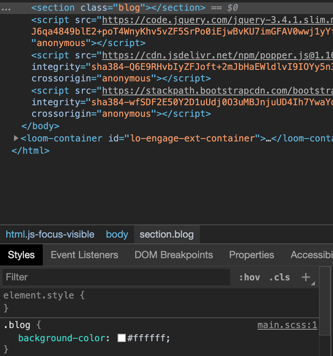

# Ej. 01 - Empezando a estructurar Sass

## Objetivo
- Establecer la estructura de SASS para nuestro proyecto, siguiendo mejores prácticas.
- Configurar el compilador de SASS para obtener nuestra hoja de estilos.

---
<br/>

## Requisitos
- Tener instalado Visual Studio Code.
- Tener instalado SASS versión dart.

---
<br/>

## Desarrollo
Sass nos permite detectar dos tipos de archivos, los que tienen extensión `.scss`
ó `.sass`. El primero tiene dicha extensión porque su sintaxis base es muy
similar a la de CSS, mientras que el segundo es una sintaxis particular (por
ejemplo: no usa llaves `{}` para englobar las propiedades de un selector). En
nuestro caso, usaremos la extensión `.scss` porque creemos que te será más fácil
de usar debido a lo que hemos ido aprendiendo en el curso. Dado que vamos a
estar usando diversos archivos de Sass, crearemos una carpeta llamada `scss` a
la misma altura de nuestros archivos principales (`index.html` y `styles.css`) y
aprovecharemos en crear un archivo llamado `main.scss` dentro de esta carpeta.

La estructura de nuestro proyecto debería verse algo así:

```text
.
+-- scss/
+----- main.scss
+-- index.html
+-- styles.css
```

Una vez con la estructura de archivos creada, abre el archivo `main.scss` y
comencemos por escribir una clase para ver un ejemplo de lo que podemos lograr:

```scss
.blog {
  background-color: #ffffff;
}
```

Ahora, ubicado en la raíz del proyecto, vamos a ejecutar el siguiente comando:

```bash
$ pwd # asegúrate de estar en la raíz del proyecto
/ruta/al/proyecto
$ sass --watch scss/main.scss output.css # la salida debería salir algo similar
Compiled scss/main.scss to output.css.
Sass is watching for changes. Press Ctrl-C to stop.
```

Este comando lo que hace es _"escuchar"_ los cambios que realizamos en los
archivos relacionados al `scss/main.scss` y cada vez que guardemos uno, este
generará un archivo llamado `output.css` y `output.css.map` con el código de CSS
que se generó a partir del archivo escrito en Sass.

Por último, para que podamos usar el CSS generado por nuestro código en Sass,
tenemos que agregar enlazar el `output.css` a nuestro HTML de la siguiente
manera:

```html
<!-- index.html -->
<head>
  <!-- Aquí vienen los enlaces a Bootstrap y styles.css -->
  <link rel="stylesheet" type="text/css" href="./styles.css" />
</head>
```

Agreguemos en el HTML la sección del blog que construiremos usando Sass:

```html
<body>
  <!-- Aquí vienen las demás secciones -->
  <section class="blog"></section>
  <!-- Aquí vienen los scripts de Bootstrap -->
</body>
```

Con esto, si inspeccionamos la sección en el devtools veremos que nuestra
sección tiene el fondo de color blanco como lo definimos en el archivo de Sass.



¡Yay! Ya estamos listos para empezar a escribir código en Sass. ¿Te diste cuenta
que el código que escribimos fue exactamente igual que solo CSS? Entonces, ¿cuál
es la ventaja de usarlo? Es lo que vamos a descubrir en el siguiente apartado.

<br/>

[Siguiente](../Ejemplo-02/README.md)