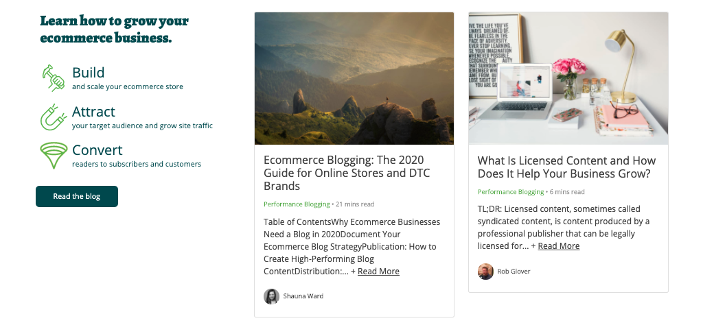

# Reto 02 - Agrega la tercera columna

## Objetivos
- Reutilizar los estilos aplicados en la colummna anterior.
- Utilizando la consola de desarrollador del navegador, obtener infromación útil para agregar al proyecto.

---
<br/>

## Requisitos
- Tener Visual Studio Code instalado.

---
<br/>

## Instrucciones

Hasta el momento vimos como insertar la primera columna, ahora solo nos falta
agregar la última columna. En general, debido a que estamos usando clases de
Bootstrap y los estilos por clase en nuestro Sass, no deberíamos necesitar de
ningún cambio en el SCSS al menos que nos falte personalizar algo. Es tu turno
de agregar la última columna y quedar listos con el blog.

<br/>

<details>
  <summary>Posible solución</summary>

En este caso, solo fue necesario agrega la misma estructura y clases que
utilizamos en nuestra segunda columna pero con el texto cambiado:

```html
<section class="container blog">
  <div class="row">
    <div class="col">
      <!-- Aquí va la columna de descripción -->
    </div>
    <div class="col">
      <!-- Aquí va la segunda columna -->
    </div>
    <div class="col">
      <div class="card">
        
        <div class="card-body">
          <h5 class="card-title">
            What Is Licensed Content and How Does It Help Your Business Grow?
          </h5>
          <p class="metadata">
            <strong class="category">Performance Blogging </strong>
            <strong class="read-time">• 6 mins read</strong>
          </p>
          <p class="card-text">
            Table of ContentsWhy Ecommerce Businesses Need a Blog in
            2020Document Your Ecommerce Blog StrategyPublication: How to Create
            High-Performing Blog ContentDistribution:...
            <span class="read-more">+ <a>Read More</a></span>
          </p>
          <div class="author d-flex align-items-center">
            
            <p>Rob Glover</p>
          </div>
        </div>
      </div>
    </div>
  </div>
</section>
```

Resultando en algo como:



</details>

<br/>

## Desplegando nuestros cambios
Esto probablemente ya lo has venido haciendo muchas veces, pero no está demás recordarlo.

Agrega tus cambios realizados a git:

```bash
$ git add -A
```

Agrega un mensaje descriptivo a tu nueva versión:

```bash
$ git commit -m "Agrega blog hecho con Sass"
```

Sube tus cambios a Github para que tengas un respaldo y siempre lo puedas descargar en cualquier otro ordenador:

```bash
$ git push origin <nombre-rama> # `master` si no estás trabajando en otra rama
```

Al realizar este último comando tus cambios estarán reflejados en Netlify y podrás revisar tu web publicada en internet, esperando que se vea algo como (o incluso mucho mejor):


<br/>

[Siguiente](../postwork/README.md)