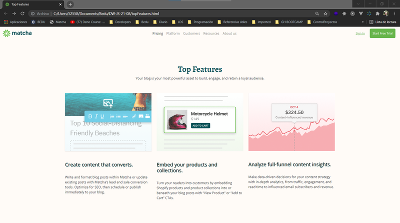

# Reto 01 - Agrega los elementos a la nueva página

## Objetivos
1. Aprender a maquetar una nueva página de nuestro proyecto
2. Utilizar la consola de desarrollador para obtener información del proyecto

---
<br/>

## REQUISITOS
- Tener instalado Visual Studio Code

---
<br/>

## INSTRUCCIONES

Ahora es tu turno de "maquetar" nuestra nueva página, con base en esta imagen. Recuerda utilizar todas las técnicas que hemos aprendido hasta ahora, y más adelante agregaremos los elementos que necesitemos para animar algunas partes de esta página.



<br/>

<details>
  <summary>Posible solución</summary>

En nuestro archivo `aboutUs.html`, debemos insertar la estuctura de HTML 5:

```html
<!DOCTYPE html>
<html lang="en">
<head>
  <meta charset="UTF-8">
  <meta http-equiv="X-UA-Compatible" content="IE=edge">
  <meta name="viewport" content="width=device-width, initial-scale=1.0">
  <title>Document</title>
</head>
<body>

</body>
</html>
```

::PRO-TIP
Si usas VS Code, puedes teclear al inicio del archivo `.html` vacío el símbolo **"!"**, y dar la tecla **TAB**. Como la herramienta Emmet está activa por default en VS Code, esto inyectará todos los elementos básicos de un archivo `.html` a tu archivo vacío.

Ahora, hay que insertar varias cosas para que nuestra nueva página funcione como las páginas anteriores que ya están funcionando.

Primero, insertemos responsividad y el CSS de Bootstrap:

```html
<!DOCTYPE html>
<html lang="en">
<head>
  <meta charset="UTF-8">
  <meta http-equiv="X-UA-Compatible" content="IE=edge">
  <meta name="viewport" content="width=device-width, initial-scale=1.0, user-scalable=no">
  <link href="https://cdn.jsdelivr.net/npm/bootstrap@5.1.3/dist/css/bootstrap.min.css" rel="stylesheet"
    integrity="sha384-1BmE4kWBq78iYhFldvKuhfTAU6auU8tT94WrHftjDbrCEXSU1oBoqyl2QvZ6jIW3" crossorigin="anonymous">
  <title>Document</title>
</head>
<body>

</body>
</html>
```

Segundo, insertemos el script JS de Bootstrap definido en su sección de instalación. Usaremos la versión **Bundle**. También insertaremos las fuentes y el archivo de estilos que resultará de compilar nuestro archivo `aboutUs.scss`.

```html
<!DOCTYPE html>
<html lang="en">
<head>
  <meta charset="UTF-8">
  <meta http-equiv="X-UA-Compatible" content="IE=edge">
  <meta name="viewport" content="width=device-width, initial-scale=1.0, user-scalable=no">
  <link href="https://cdn.jsdelivr.net/npm/bootstrap@5.1.3/dist/css/bootstrap.min.css" rel="stylesheet"
    integrity="sha384-1BmE4kWBq78iYhFldvKuhfTAU6auU8tT94WrHftjDbrCEXSU1oBoqyl2QvZ6jIW3" crossorigin="anonymous">
  <link rel="preconnect" href="https://fonts.googleapis.com">
  <link rel="preconnect" href="https://fonts.gstatic.com" crossorigin>
  <link
    href="https://fonts.googleapis.com/css2?family=Alegreya:wght@500;700;900&family=Slabo+27px&family=Open+Sans&display=swap"
    rel="stylesheet">
  <link rel="stylesheet" href="./aboutUs.css">
  <title>Document</title>
</head>
<body>

  <script src="https://cdn.jsdelivr.net/npm/bootstrap@5.1.3/dist/js/bootstrap.bundle.min.js"
    integrity="sha384-ka7Sk0Gln4gmtz2MlQnikT1wXgYsOg+OMhuP+IlRH9sENBO0LRn5q+8nbTov4+1p"
    crossorigin="anonymous"></script>
</body>
</html>
```

Tercero, agreguemos la barra de navegación y modifiquemos sus enlaces para que se ajuste a lo que ya tenemos trabajando. Tambien cambiaremos el título de la página.

```html
<!DOCTYPE html>
<html lang="en">
<head>
  <meta charset="UTF-8">
  <meta http-equiv="X-UA-Compatible" content="IE=edge">
  <meta name="viewport" content="width=device-width, initial-scale=1.0, user-scalable=no">
  <link href="https://cdn.jsdelivr.net/npm/bootstrap@5.1.3/dist/css/bootstrap.min.css" rel="stylesheet"
    integrity="sha384-1BmE4kWBq78iYhFldvKuhfTAU6auU8tT94WrHftjDbrCEXSU1oBoqyl2QvZ6jIW3" crossorigin="anonymous">
  <link rel="preconnect" href="https://fonts.googleapis.com">
  <link rel="preconnect" href="https://fonts.gstatic.com" crossorigin>
  <link
    href="https://fonts.googleapis.com/css2?family=Alegreya:wght@500;700;900&family=Slabo+27px&family=Open+Sans&display=swap"
    rel="stylesheet">
  <link rel="stylesheet" href="./aboutUs.css">
  <title>About us</title>
</head>
<body>

  <nav class="navbar navbar-expand-lg navbar-light fixed-top">
    <div class="container-fluid">
      <a class="navbar-brand" href="./index.html">
        
      </a>
      <button class="navbar-toggler" type="button" data-bs-toggle="collapse" data-bs-target="#navbarSupportedContent"
        aria-controls="navbarSupportedContent" aria-expanded="false" aria-label="Toggle navigation">
        <span class="navbar-toggler-icon"></span>
      </button>
      <div class="collapse navbar-collapse" id="navbarSupportedContent">
        <ul class="navbar-nav mx-auto mb-2 mb-lg-0">
          <li class="nav-item">
            <a class="nav-link active" aria-current="page" href="./pricing.html">Pricing</a>
          </li>

          <li class="nav-item">
            <a class="nav-link" href="#">Platform</a>
          </li>

          <li class="nav-item">
            <a class="nav-link" href="#">Customers</a>
          </li>

          <li class="nav-item">
            <a class="nav-link" href="#">Resources</a>
          </li>

          <li class="nav-item">
            <a class="nav-link" href="#">About us</a>
          </li>

        </ul>
        <form class="signup-form actions">
          <a href="#">Sign In</a>
          <button>Start Free Trial</button>
        </form>
      </div>
    </div>
  </nav>


  <script src="https://cdn.jsdelivr.net/npm/bootstrap@5.1.3/dist/js/bootstrap.bundle.min.js"
    integrity="sha384-ka7Sk0Gln4gmtz2MlQnikT1wXgYsOg+OMhuP+IlRH9sENBO0LRn5q+8nbTov4+1p"
    crossorigin="anonymous"></script>
</body>
</html>
```

Cuarto, agreguemos los estilos que corresponden a nuestra página y barra de navegación, en el archivo `scss/aboutUs.scss`. Recuerda que debes arrancar el compilador en la terminal, en el directorio base del proyecto:

```text
> sass --watch scss/aboutUs.scss aboutUs.css
```

Ahora puedes insertar el SCSS y verás como va cambiando los estilos en la pantalla.

```css

body {
  background-color: #fffbf7 !important;
  margin: 0;
  font-family: "Open Sans", sans-serif;
}

.navbar {
  background-color: #fffbf7;
  text-align: center;
  color: #025157;
  font-weight: 500;

  ul {
    padding: 0;
  }
}

.actions {
  text-align: right;
  font-size: 14px;

  & > * {
    margin: 0 10px;
  }

  a {
    color: #67b54b;
  }

  button {
    background-color: #67b54b;
    color: white;
    padding: 12px 14px;
    border: 0;
    border-radius: 5px;
  }
}


```

<br/>

Quinto, agreguemos nuestro contenido. Puedes observar en [la página de Matcha](https://getmatcha.com) los estilos aproximados que necesitamos. Puedes practicar también tu dominio de Bootstrap para agregar este contenido. Como ahora estás maquetando, tus conocimientos de Flexbox y CSS Grid serán de mucha utilidad, y los trucos que aprendiste en este módulo te ayudarán también.

<br />

```html
<section class="top-features">
    <div class="container">
      <div class="row">
        <div class="col-md-12">
          <header class="section-title">
            <h1 class="header--alt">Top Features</h1>
            <p>Your blog is your most powerful asset to build, engage, and retain a loyal audience.</p>
          </header>
        </div>
      </div>

      <div class="row">
        <div class="col-md-4">
          <div class="feature__cont">
            <div class="feature__img shadow-sm">
              
            </div>
            <a class="feature__title__anchor" href="https://getmatcha.com/blog-creator/#feature-block-1">
              <h3 class="feature__title">Create content that converts.</h3>
            </a>
            <p>
              Write and format blog posts within Matcha or update existing posts with Matcha’s lead and sale conversion
              tools. Optimize for SEO, then schedule or publish immediately to your blog.
            </p>
          </div>
        </div>

        <div class="col-md-4">
          <div class="feature__cont">
            <div class="feature__img">
              
            </div>
            <a class="feature__title__anchor" href="https://getmatcha.com/blog-creator/#feature-block-2">
              <h3 class="feature__title">Embed your products and collections.</h3>
            </a>
            <p>Turn your readers into customers by embedding Shopify products and product collections into or beneath
              your blog posts with “View Product” or “Add to Cart” CTAs.</p>
          </div>
        </div>

        <div class="col-md-4">
          <div class="feature__cont">
            <div class="feature__img">
              
            </div>
            <a class="feature__title__anchor" href="https://getmatcha.com/blog-creator/#feature-block-7">
              <h3 class="feature__title">Analyze full-funnel content insights.</h3>
            </a>
            <p>Make data-driven decisions for your content strategy with in-depth analytics, from traffic, engagement,
              and read time to influenced email subscribers and revenue.</p>
            <p></p>
          </div>
        </div>
      </div>
    </div>
  </section>

```
<br/>

Y en el archivo scss/aboutUs.scss:

<br/>

```css
/* Aqui van los estilos que copiamos de las otras páginas que funcionan */

.top-features {
  padding: 30px 0 65px;
  margin-top: 150px;
}

.section-title {
  text-align: center;
  margin-bottom: 60px;

  h1 {
    color: #025157;
    font-family: 'Alegreya', serif;
    font-weight: 700;
  }
}

.feature__img {
  img {
    width: 100%;
  }
}

.feature__title__anchor {
  text-decoration: none;
  color: inherit;
  font-weight: 500;
  font-size: 24px;

  .feature__title {
    margin-top: 50px;
    font-weight: 500;
    font-size: 24px;
    font-family: 'Open Sans',sans-serif;
    margin-bottom: 35px;
    text-decoration: none;
    color: inherit;
  }
}

```
<br/>
Ahora, la página debe verse similar a:


<br/>
</details>

<br/>

[Siguiente](../Ejemplo-02/README.md)