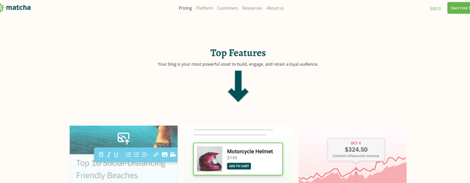
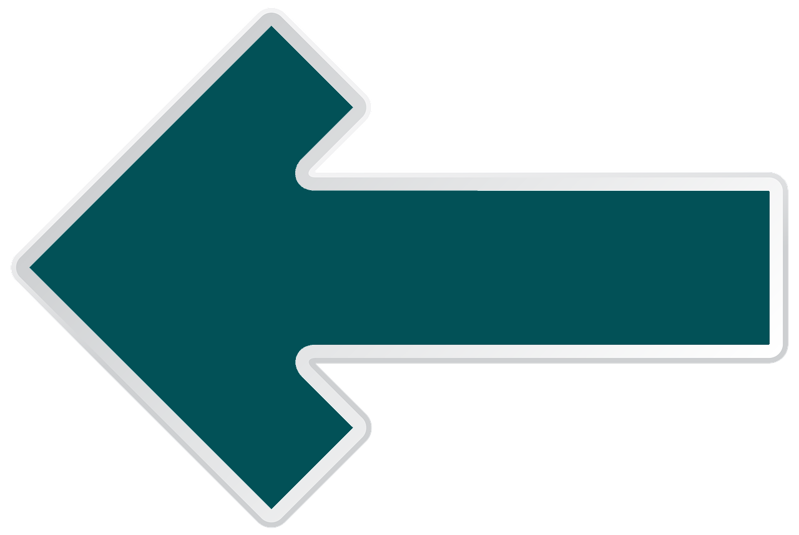

# Reto 03 - Agregar una animación con CSS

## Objetivos:
1. Utilizar una animación para mostrar elementos con movimiento en la página.
2. Modificar la animación para utilizar más de una en un mismo elemento.

---
<br/>

## Requisitos
- Tener Git Bash si usas Windows.
- Tener una cuenta de Netifly

---
<br/>

## Instrucciones

Para cerrar con broche de oro este curso, te tocará implementar una animación con un nuevo elemento. Debes insertar una flecha que se mueva hacia abajo 60px y vuelva a la posición inicial. Para ello, te recomendamos utilizar una nueva fila con Bootstrap, y aplicar un offset de 4 columnas para que el contenedor sea también de cuatro columnas, logrando el centrado de esos elementos.

Una vez logrado eso, debes agregar tres elementos `<div>` para usarlos con distintas funciones para esta animación:
- Contenedor de los elementos.
- Contenedor donde la animación se utilizará, con posición relativa. Recuerda que esta posición hará que los elementos dentro del `<div>`, que tengan posición absoluta, se "peguen" a este contenedor y puedas ser utilizado como referencia dentro de la presentación visual.
- Contenedor de la imagen con posición absoluta. Aquí estará la imagen y la animación.

Esta es una imagen de cómo debe iniciar tu animación.


<br/>

Aquí encontrarás el elemento a animar. Recuerda investigar en Google cómo rotar elementos con CSS.




<br/>

<details>
  <summary>Posible solución</summary>


  Como lo habíamos comentado en la introducción a este reto, debes insertar una elemento **row**, y después un elemento de ancho col-md-4, con clase offset-md-4, para que sea posible centrar toda la animación sin necesidad de utilizar Flexbox o Grid de manera nativa.

  Ahora, crearemos los elementos con clase `.flecha`, `.flecha-contenedor` y `.flecha-animada`, que funcionarán a nuestro favor para mantener centrado el elemento animado.

```html

<!-- Aquí va el elemento de texto de Top Features -->

<!-- Este es el nuevo elemento que debes insertar -->
      <div class="row">
        <div class="offset-md-4 col-md-4">
          <div class="flecha">
            <div class="flecha-contenedor">
              <div class="flecha-animada">
                
              </div>
            </div>
          </div>
        </div>
      </div>
<!-- Aquí abajo están las imágenes -->
```

<br/>
Debemos recordar que una de las animaciones más sencillas es mover en un solo eje al elemento. Los elementos de posición, cuando el elemento tiene posición absoluta son la solución: *top*, *bottom*, *left* y *right*. Estas propiedades permiten mover desde la posición inicial en un solo eje, si usas la combinación *top-bottom* o *left-right*. Si quieres moverlo en dos dimensiones (como si lo movieras en diagonal), usarias las dos combinaciones.

Repasando tu material del prework, te diste cuenta que las animaciones no solo son declarar propieades de CSS, sino que debes emplear reglas conocidas como `@keyframes`. Ahí debes colocar los estados que debe tener tu animación según avance en porcentaje.

Las animaciones tienen propiedades que definen la animación: nombre de la regla que aplicarás, duración, veces que se repetirá, dirección y tipo de función de presentación. Ésta última propiedad la debes entender como la forma en que un elemento se moverá al inicio y/o final de un estado de animación.

Vamos a agregar las propiedades CSS para que después nos organicemos con las reglas.

<br/>

```css

.flecha {
  margin: 0 auto;
  height: 130px;
  width: 130px;
  margin-bottom: 35px;

  .flecha-contenedor {
    position: relative;
    height: 150px;
    width: 150px;
    margin-bottom: 65px;

    .flecha-animada {
      position: absolute;
      animation-name: up-and-down;
      animation-duration: 3s;
      animation-timing-function: linear;
      animation-iteration-count: infinite;
      animation-direction: alternate;
      height: 130px;
      width: 130px;

      img {
        width: 130px;
        transform: rotate(-90deg);
      }
    }
  }
/* Aqui pondremos las reglas de @keyframes */
}

```
<br/>

Estos estilos por el momento solo rotan la imagen de la flecha hacia abajo, y todavía no hacen nada porque no hemos definido los diferentes estados de la animación con nombre **"up-and-down"**.

Las reglas `@keyframes` definen esos estados o condiciones. Por ejemplo, si quieres que la flecha baje y vuelva a subir al punto inicial, tienes dos estados. El primer estado te permite tomar la flecha en su estados base, es decir, en la parte superior. Cuando la mueves hacia abajo, el segundo estado es cuando alcanza la posición de 60px abajo de la posición inicial, y el tercer estado es cuando regresa al origen.

Vamos a agregar esta regla.

<br/>

```css

.flecha {
  margin: 0 auto;
  height: 130px;
  width: 130px;
  margin-bottom: 35px;

  .flecha-contenedor {
    position: relative;
    height: 150px;
    width: 150px;
    margin-bottom: 65px;

    .flecha-animada {
      position: absolute;
      animation-name: up-and-down, alrededor;
      animation-duration: 3s;
      animation-timing-function: linear;
      animation-iteration-count: infinite;
      animation-direction: alternate;
      height: 130px;
      width: 130px;

      img {
        width: 130px;
        transform: rotate(-90deg);
      }
    }

/* Estamos agregando la regla de descender y subir al punto inicial */
    @keyframes up-and-down {
      0% {
        top: 0; /* Aquí inicia la animación */
      }

      25% {
        top: -30px; /* Este es el punto donde alcanza la mitad del límite de los 60px, moviéndose hacia abajo */
      }

      50% {
        top: -60px; /* Este es el punto donde alcanza el límite de los 60px */
      }

      75% {
        top: -30px; /* Este es el punto donde alcanza la mitad del límite de los 60px, moviéndose hacia arriba */
      }

      100% {
        top: 0; /* Aquí termina la animación, ubicando el elemento en el punto de inicio */
      }
    }
  }
```
<br/>

Como puedes notar, una animación solo requiere establecer el recorrido de los elementos.

Ahora, ¿podrías hacer una animación que ahora mueva de arriba a abjo la flecha, sino también de lado a lado?. ¡Inténtalo! Es bastante entretenido...

<br/>

```css

.flecha {
  margin: 0 auto;
  height: 130px;
  width: 130px;
  margin-bottom: 35px;

  .flecha-contenedor {
    position: relative;
    height: 150px;
    width: 150px;
    margin-bottom: 65px;

    .flecha-animada {
      position: absolute;
      animation-name: up-and-down, alrededor;
      animation-duration: 3s;
      animation-timing-function: linear;
      animation-iteration-count: infinite;
      animation-direction: alternate;
      height: 130px;
      width: 130px;

      img {
        width: 130px;
        transform: rotate(-90deg);
      }
    }

    @keyframes alrededor {
      from {left: -270px;}
      to {left: 270px;}
    }

    @keyframes up-and-down {
      0% {
        top: 0;
      }

      25% {
        top: -30px;
      }

      50% {
        top: -60px;
      }

      75% {
        top: -30px;
      }

      100% {
        top: 0;
      }
    }
  }

```
<br/>

Solo un pequeño detalle: como verás, el código no está optimizado, ya que usamos dos animaciones definidas por los dos `@keyframe`. Lo hicmos así para que observes cómo podemos utilizar el CSS, siendo esto sólo un ejemplo de cómo puedes dar pequeños detalles extra a tu código y presentar proyecto impactantes con simple CSS.


</details>


<br/>

[Siguiente](../postwork/README.md)